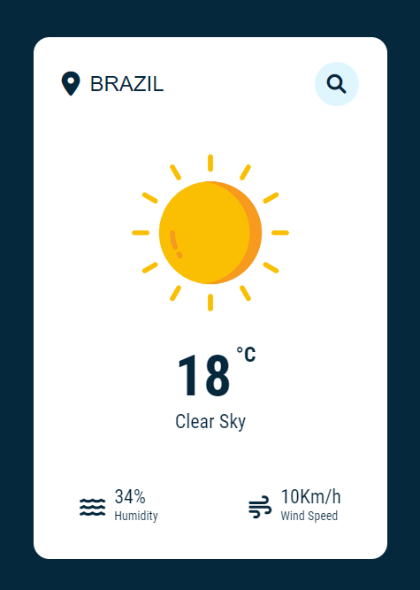

### Weather App
This code allows users to search for the current weather of a city, displaying relevant information (such as temperature, description, humidity, and wind speed) by fetching data from the OpenWeatherMap API. If an invalid city is entered, an error message is shown. The content fades in smoothly for a better user experience.
Made with javascript.

tutorial project made by: https://www.youtube.com/@AsmrProg

# Screenshot
Here we have project screenshot :

